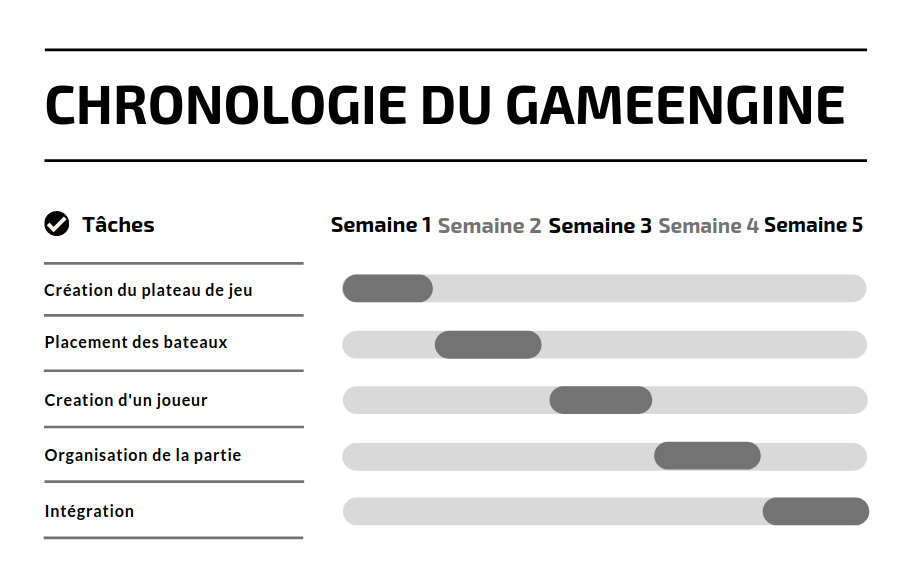
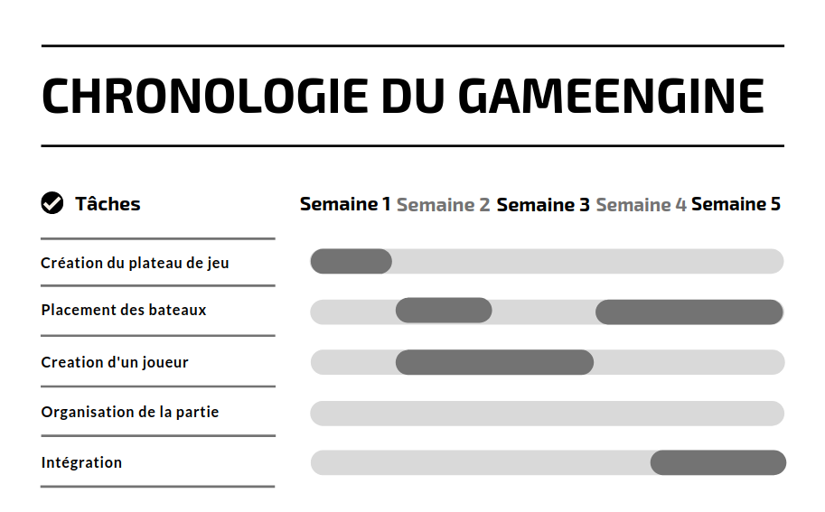

# GameEngine Documentation

Auteur : Huet Samuel

Depo : https://github.com/massicotjgab/mega-bataille-navale
## Introduction

La conception du moteur du jeu m'a beaucoup apporté en python. D'une part, les classes, que je ne maitrisais pas du tout. Je sais maintenant déclarer un objet, des fonctions et des variables au sein de cet objet. Le point qui a le plus péché pour nous a été l'intégration. Surtout en matière de graphique. Nous avons eu du mal à nous accorder que la manière dont nos parties allait communiquer, nous obligeant à réaliser des solution "par défaut" qui ne collait pas forcément et qu'il faudrait modifier par la suite. J'ai donc perdu beaucoup de temps et d'énergie à immaginer des solution qui au final n'ont pas servis car incompatible avec les fonctions des autres.
La communication avec la partie réseau a été plus simple. J'ai imposé à mon collège s'occupant du réseau (Thomas Coutant) de se concentrer sur la communication réseau en lui assurant le fait que je lui fournirait les tram toutes prètes. Il n'aura plus qu'a les envoyer.

## Difficultés
Voici une liste des trois plus grosses difficulités que j'ai rencontré lors de ce projet.
###### L'organisation
L'oganisation de ma partie s'est révélé relativement compliqué. D'autant plus que le système d'objet et de classes était relativement nouveau pour moi. J'ai donc du me reprendre à plusieurs fois afin de réaliser une système qui soit compréhensible et fonctionnel.
###### La communication
La communication a été un des plus gros frein lors de ce projet. En effet, j'ai avancé plus vite que l'interface graphique, m'obligeant à prendre des décisions qui ne ce sont pas révélé efficaces, avec l'obligation de corriger le tout par la suite.
###### Git
Ce projet fut notre premier projet collaboratif sur git. Et ce ne fut pas sans ratés. Entre la prise en main des pull requests et des branches, il a fallu un bon moment pour s'y accomodé. J'estime que c'est chose faite maintenant et je comprends bien mieux ce système.

## Notions apprises

Parmis les notions aquises lors de ce projet, les plus importantes restent la notion d'objet et de classe du python, qui n'est pas indispensable mais que l'on peut considérer comme tel tant cela rend le code lisible et maintenable.
On pourra également noter l'utilisation de git de façon collective, en forkant le repo de quelqu'un d'autre (Jean-Gabriel Massicot), en gerant nos branches, nos pull request, mais également des tests automatiques et un indicateur de couverture de code.

## Planification
### Prévisionnel

### Réèl

### Ecarts
Le changement total de stratégie quant à l'ordre des tâches s'explique simplement par une compréhension plus poussé du projet et des problématiques au fil des jours. On peut également voir que le placement des bateaux a pris bien plus de temps que prévu du fait d'un manque de communication et du fait que j'ai commencé à réaliser cette partie en avance par rapport à l'interface graphique, ce qui m'a obligé à reprendre par le suite. C'est pourquoi on retrouve dans mon code des vestiges d'une classe `Bateau` qui n'a plus lieux d'exister (laissé pour montrer les pistes de recherches). La création du joueur s'est révélé être le coeur du moteur du jeu, j'y ai donc passé un peu plus de temps que prévu.
Pour eviter les écarts nous aurions du prendre le temps de se mettre d'accord sur les protocoles à utiliser et sur la répartition précises de chacun.
## Comment l'utiliser
### Création d'un joueur

 Le moteur du jeu fonctionne en adéquation avec la création d'un joueur. Sans joueur, pas de jeu. Pour pouvoir commencer une partie, il est donc nécéssaire de créer un joueur en définissant son peudo. Définissont alors deux joueurs adverses. Il est à noter qu'on pourrait également créer un seul joueur. Dans ce cas-ci, il faudra envoyer et recevoir les requêtes, géré par la partie réseau. Pour s'affranchir de cette partie réseau, nous allons créer deux joueurs.

```
Joueur1 = Joueur("Toto_du_30")
Joueur2 = Joueur("La_bichette_du_93")
```
Ensuite, dans le cas d'une partie en réseau, les joueurs doivent s'échanger leur pseudo, il va donc falloir que chacun crée une tram à envoyer à l'autre joueur, et également décrypter la tram du joueur adverse.

```
Tram = Joueur1.format_pseudo()
Joueur2.decrypt_tram(Tram)

Tram = Joueur2.format_pseudo()
Joueur1.decrypt_tram(Tram)
```
Grâce à ce mécanisme, on pourra récupérer le pseudo du joueur adverse ou même son propre pseudo pour l'afficher sur l'interface graphique de cette façon :
```
Pseudo = Joueur1.get_pseudo()
pseudo_adversaire = Joueur1.get_pseudo_adversaire()
```
A noter qu'il est possible à tout moment de changer le pseudo si nécéssaire en utilisant cette fonction :
```
Joueur1.change_pseudo("Toto_du_32")
```

### Tirer et subir

Supposons que le Joueur1 veuille tirer. Il va devoir créer une tram correspondant à la coordonée sur laquelle il souhaite tirer.
```
x = 10
y = 5
Tram = Joueur1.tirer(x, y)
```

La tram est créee, elle est envoyé par notre partie réseau, il faut maintenant la faire décrypter par notre adversaire pour obtenir une réponse, qu'il faudra à notre tour décrypter, ceci afin de mettre à jour nos plateaux de jeu respectif.
```
Reponse = Joueur2.decrypt_tram(Tram)
Joueur1.decrypte_tram(Reponse)
```

### Envois vers la GUI

Le formatage de la donnée est on ne peut plus simple. Le plateau qui est en temps normal à 3 dimensions (15x15x3) est convertit en tableau à une dimensions à 675 cases, où l'indice du tableau correspondra à un ID unique. La première case du tableau à une dimension correpondra à la case situé en haut à gauche sur le plateau le moins profond, et la dernière case correpondra à la case située en bas à droite sur le plateau le plus profond.
Ensuite, il existe un code pour chaque case, ce code diffère légèrement s'il s'agit du plateau d'attaque ou de défense :

#### Attaque

| Caractère     |Correspondance   |
| :---:         | :---:           |
| 0             | Inexploré       |
| X             | Coup dans l'eau |
| T             | Touché          |

```
tab_attaque = self.Joueur1.formate_attaque_gui()
```

#### Défense
| Caractère     |Correspondance   |
| :---:         | :---:           |
| 0             | Eau             |
| X             | Coup dans l'eau |
| X_NomBateau   | NomBateau touché|

```
tab_defense = self.Joueur1.formate_defense_gui()
```

### Placement des bateaux

Le placement des bateaux est en lien direct avec la façon de formater la donnée pour la GUI, c'est pourquoi je ne l'aborde que maintenant.
Pour se faire, il faudra fournir au moteur de jeu le nom du bateau, ainsi qu'un tableau contenant la liste des ID des cases qui contiendront ce bateau. Un verification est effectuée pour voir si toutes les cases sont bin adjacentes. Il n'existe pas de limite de bateau, l'interface est sensée limiter les actions du joueur.
```
Joueur1.place_bateau("Sous_marin", [225, 226, 240, 241])
```

## Conclusion

Pour conclure, j'ai trouvé ce projet très interessant, me permettant d'apprendre plus en profondeur des notions de python de git que je ne maîtrisais pas. Cependant, j'aurai aimé avoir le temps de me plonger dans les parties des autres membres de mon équipe afin de les aider et d'apprendre avec eux. Ce qui était compliqué étant donné le temps aloué. 
